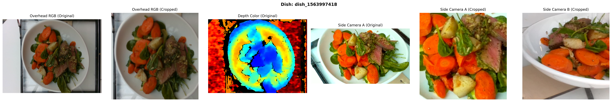

# DeepDiet: Multimodal Deep Learning for Nutritional Content Estimation

[](docs/DeepDiet___Project_Final-6.pdf)
[](https://cs230.stanford.edu/)
[](https://www.python.org/downloads/)
[](https://pytorch.org/)

> **[Read the Full Project Report (PDF)](docs/DeepDiet___Project_Final-6.pdf)**

A Stanford CS230 Deep Learning project that estimates nutritional information (calories, mass, fat, carbs, protein) from multi-view food images using the [Nutrition5k dataset](https://github.com/google-research-datasets/Nutrition5k).

## Overview

DeepDiet explores how different deep learning architectures handle the task of nutritional estimation from food imagery. We implement and compare three approaches:

1. **Multi-modal CNN-LSTM** - A multi-branch fusion architecture combining EfficientNet-B0 encoders with BiLSTM temporal aggregation for side-view video frames
2. **Cross-Swin-CLS** - Feature Pyramid Network with Swin Transformer backbone and cross-attention decoder
3. **ConvNeXt** - Modernized ConvNet with differential learning rates for efficient transfer learning

### Key Innovation

Processing temporal sequences of 16 rotating side-view frames (from 4 cameras) combined with overhead RGB and depth images for comprehensive food volume and nutrient estimation.

<p align="center">
  
</p>

## Architecture

The primary Multi-modal CNN-LSTM model uses a three-branch encoder-fusion architecture:

```
┌─────────────────┐     ┌─────────────────┐     ┌─────────────────┐
│   Side Frames   │     │  Overhead RGB   │     │  Overhead Depth │
│  [B, 16, 3, H, W]│     │   [B, 3, H, W]  │     │   [B, 1, H, W]  │
└────────┬────────┘     └────────┬────────┘     └────────┬────────┘
         │                       │                       │
         ▼                       ▼                       ▼
┌─────────────────┐     ┌─────────────────┐     ┌─────────────────┐
│  EfficientNet-B0│     │  EfficientNet-B0│     │  EfficientNet-B0│
│     Encoder     │     │     Encoder     │     │   (1-ch input)  │
└────────┬────────┘     └────────┬────────┘     └────────┬────────┘
         │                       │                       │
         ▼                       │                       │
┌─────────────────┐              │                       │
│ BiLSTM/Attention│              │                       │
│   Aggregation   │              │                       │
└────────┬────────┘              │                       │
         │                       │                       │
         └───────────────┬───────┴───────────────────────┘
                         ▼
               ┌─────────────────┐
               │  Feature Fusion │
               │  (3840 → 1024)  │
               └────────┬────────┘
                        │
         ┌──────────────┼──────────────┐
         ▼              ▼              ▼
    ┌─────────┐   ┌──────────┐   ┌──────────┐
    │  Mass   │   │ Calories │   │  Macros  │
    │  Head   │   │   Head   │   │   Head   │
    └─────────┘   └──────────┘   └──────────┘
```

## Results

### Multi-modal CNN-LSTM (Baseline: Overhead + Depth)

| Metric      | Nutrition5k (Depth 4ch) | Nutrition5k (Volume) | Ours (Fusion) |
|-------------|-------------------------|----------------------|---------------|
| Calorie MAE | 47.6                    | 41.3                 | 49.9          |
| Mass MAE    | 40.7                    | 29.4                 | **33.0**      |
| Fat MAE     | 2.27                    | 3.0                  | 4.6           |
| Carb MAE    | 4.6                     | 4.5                  | 10.1          |
| Protein MAE | 3.7                     | 5.2                  | 7.2           |

### Cross-Swin-CLS Performance

| Category      | SMAPE (%) | PMAE (%) |
|---------------|-----------|----------|
| Calories      | 22.50     | 16.61    |
| Mass          | 15.93     | 10.87    |
| Fat           | 50.54     | 27.06    |
| Carbohydrates | 37.44     | 23.81    |
| Protein       | 37.37     | 23.95    |
| **Average**   | **32.76** | **20.44**|

## Installation

```bash
# Clone the repository
git clone https://github.com/gernim/deepdiet.git
cd deepdiet

# Create virtual environment
python -m venv .venv
source .venv/bin/activate  # On Windows: .venv\Scripts\activate

# Install dependencies
pip install -r requirements.txt
```

### Dataset Setup

1. Download the [Nutrition5k dataset](https://github.com/google-research-datasets/Nutrition5k)
2. Place data in `data/nutrition5k_dataset/`
3. Use the official train/test splits in `indexes/`

## Usage

### Training

```bash
# Basic training with overhead RGB + depth (baseline)
python src/train.py --use-overhead --use-depth --epochs 20 --batch-size 8

# Full multi-modal training with side frames
python src/train.py --use-side-frames --use-overhead --use-depth --epochs 20

# Training with attention aggregation instead of LSTM
python src/train.py --use-side-frames --side-aggregation attention --grad-clip 0.5

# Training with frozen encoders (transfer learning)
python src/train.py --use-side-frames --freeze-encoders --unfreeze-epoch 10

# Resume from checkpoint
python src/train.py --use-side-frames --resume checkpoints/best_model.pt

# Enable Weights & Biases logging
python src/train.py --use-side-frames --wandb --wandb-project deepdiet
```

### Hydra-based Configuration

```bash
# Default configuration
python src/train_hydra.py

# Override parameters
python src/train_hydra.py model.side_aggregation=attention training.lr=5e-5
```

### Viewing Training Logs

```bash
tensorboard --logdir runs/
```

## Project Structure

```
deepdiet/
├── configs/                 # Hydra configuration files
│   ├── model/              # Model configurations
│   ├── training/           # Training hyperparameters
│   ├── data/               # Data loading settings
│   └── logging/            # Logging configurations
├── data/
│   └── nutrition5k_dataset/ # Dataset location
├── docs/
│   └── DeepDiet___Project_Final-6.pdf  # Project report
├── indexes/                 # Train/test split CSV files
├── runs/                    # TensorBoard logs
├── src/
│   ├── model.py            # DeepDietModel architecture
│   ├── dataset.py          # MultiViewDataset data loader
│   ├── train.py            # Main training script
│   ├── train_hydra.py      # Hydra-based training
│   ├── config.py           # TrainingConfig dataclass
│   ├── transforms.py       # Data augmentation
│   ├── metrics.py          # Metric tracking utilities
│   └── training/
│       └── epoch.py        # Training/validation loops
└── requirements.txt
```

## Key Findings

1. **Overhead + Depth baseline** achieves competitive performance with simpler architecture
2. **Side-angle frames** introduce overfitting risk - the model memorizes frame patterns rather than learning generalizable food features
3. **Cross-Swin-CLS** demonstrates best generalization (29% train-test gap)
4. **Differential learning rates** significantly reduce overfitting in ConvNeXt models

## Citation

If you use this code in your research, please cite:

```bibtex
@misc{deepdiet2025,
  title={DeepDiet: Multimodal Deep Learning for Nutritional Content Estimation},
  author={Rawat, Mini and Gernitis, Mark and Sharma, Neetish},
  year={2025},
  institution={Stanford University, CS230}
}
```

## References

- [Nutrition5k Dataset](https://github.com/google-research-datasets/Nutrition5k) - Thames et al., 2021
- [EfficientNet](https://arxiv.org/abs/1905.11946) - Tan & Le, 2019
- [Swin Transformer](https://arxiv.org/abs/2103.14030) - Liu et al., 2021
- [ConvNeXt](https://arxiv.org/abs/2201.03545) - Liu et al., 2022

## License

This project is for educational purposes as part of Stanford CS230.

## Authors

- **Mini Rawat** - [minir07@stanford.edu](mailto:minir07@stanford.edu)
- **Mark Gernitis** - [gernitis@stanford.edu](mailto:gernitis@stanford.edu)
- **Neetish Sharma** - [neetishs@stanford.edu](mailto:neetishs@stanford.edu)
